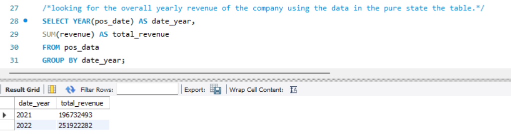
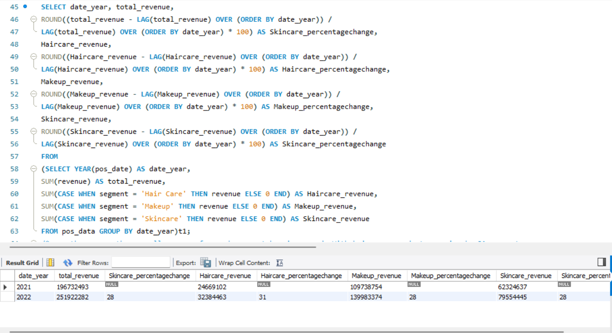
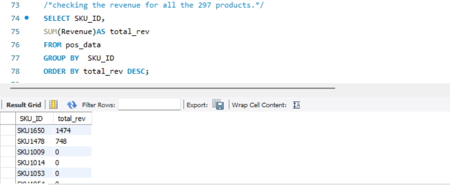
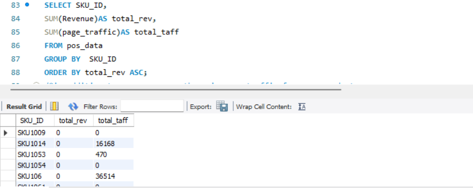
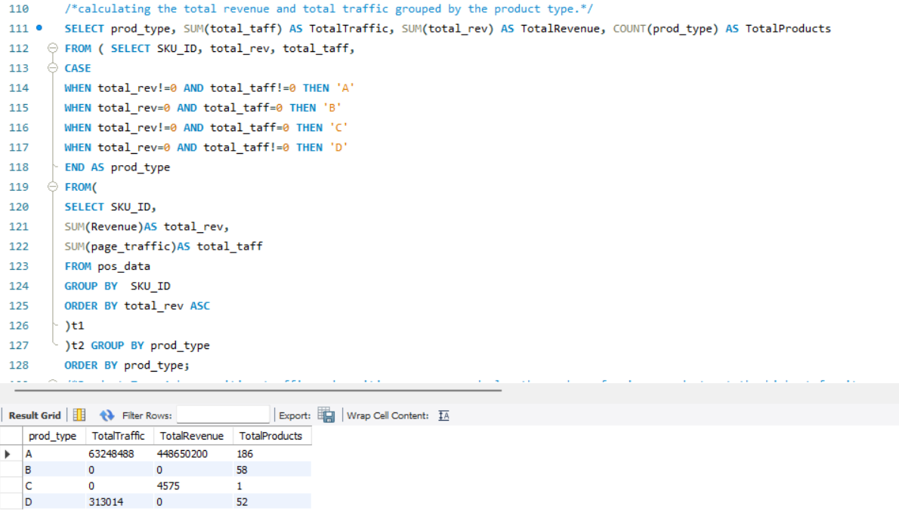
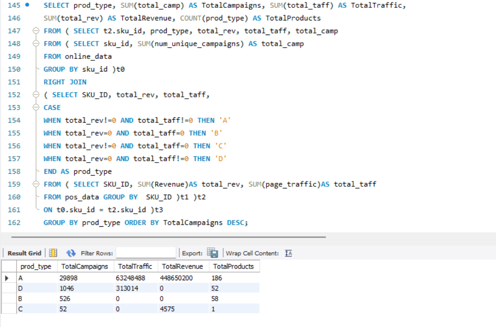
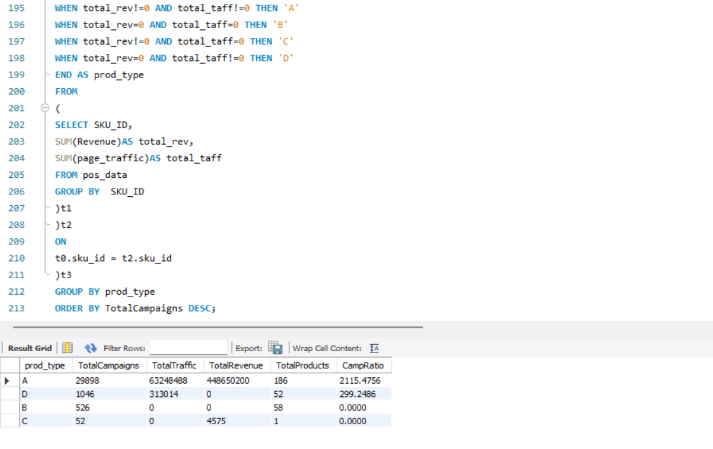

# Synergix's Sales Performance Analysis 

## Introduction
Synergix Solutions, a multinational e-commerce company, specializes in a wide range of consumer goods and has a strong market presence. The company launched its e-commerce platform two years ago, which successfully attracted a diverse customer base from around the globe. Despite this success, recent sales trends have not met expectations, prompting concern among the management team about the company's growth trajectory and future sustainability.
## Objective
The primary objective of this project is to leverage SQL analytical techniques, including subqueries and LAG functions, to uncover potential issues impacting sales. The goal is to gain actionable insights that can inform strategic decisions to improve the company's sales performance and overall market position.
## Challenge
Despite implementing various strategies, including discounts, promotions, and advertisements, the anticipated increase in sales has not materialized. The management suspects that underlying issues may be affecting sales performance, necessitating a deeper analysis to identify and address these challenges.
## Task
1. Data Extraction: Utilize SQL queries to extract relevant data from the six tables.

2. Data Cleaning and Transformation: Ensure data accuracy and consistency through cleaning and transformation processes.

3. Analytical Techniques:

o	Subqueries: To perform detailed comparative analyses, such as period-over-period comparisons or segment-specific performance.

o	LAG Function: To analyze trends over time, including month-on-month or year-on-year sales changes.

## Data & Resource Used

**Dataset**

Option 1: [Kaggle](https://www.kaggle.com/datasets?fileType=csv)

Option 2: And, also the dataset can be found on [Fractal Analytics](https://www.coursera.org/learn/data-analysis-sql) Coursera Course. I am grateful for his guidance on this project.

**Tool** 

MySQL Workbench

## Data Cleaning and Preparation
### 1. Extract the data by utilize SQL queries to extract relevant data from the six tables.
Checking NULL values, blanks and Errors.

Removing duplicates, and irrelevant columns.

Ensure data consistency and accuracy through cleaning and transformation processes.
### 2. Create a schema, which is nothing but a database.

Ensure the tables includes all required columns for analysis.

Load .sql script on the query editor and run the script to load all tables in database.

Explore the different tables that are present in the synergix database
### 3. Key Analysis Areas
1. Sales Trend Analysis

2. Customer Segmentation

3. Product Performance

4. Promotions and Discounts Impact

5. Market and Regional Analysis

6. Competitor Analysis
## Data Analysis

1.	**Sales Trend Analysis:**

•	Investigate sales trends over time to identify any significant declines or stagnations.

•	Utilize subqueries to compare current sales data against historical performance.

2.	**Customer Segmentation:**

•	Analyze customer demographics and purchasing behaviors to identify key segments.

•	Determine if certain customer groups are underperforming in terms of sales.

3.	**Product Performance:**

•	Evaluate the sales performance of different product categories and individual products.

•	Identify products with declining sales or those that have underperformed expectations.

4.	**Promotions and Discounts Impact:**

•	Assess the effectiveness of discounts and promotional strategies in driving sales.

•	Use subqueries to compare sales during promotional periods with non-promotional periods.

5.	**Market and Regional Analysis:**

•	Analyze sales performance across different regions and markets.

•	Identify regions with lower-than-expected sales growth and potential reasons.

6.	**Competitor Analysis:**

•	Compare sales trends with industry benchmarks or competitors, if data is available.

•	Utilize subqueries and LAG functions to analyze competitor performance over time.

## Key Findings
### 1. Revenue related factors
•	**Looking for the overall yearly revenue of the company.**

		**Note:** There is over 28% growth in the overall revenue of the company.

•	**The percentage change in total revenue over the years.**   

		**Note:** Over the years, the overall revenue for each segment has increased. With hair care products growing by 31 percent. Skincare products growing by 27.6 percent(28), and makeup by 27.5 percent(28). When we see that the sales have not been going up as predicted, it may not be with respect to the overall sales or sales for each segment of products, but it could be at a product level. May be only certain products drive the sales.

  

### 2. Product Based Analysis of Sales   
•	**Checking the revenue for all the 297 products.**   

		**Note:** There are a lot of products with zero revenue.These are those products which are not contributing to the growth of the company, but are these products experiencing any traffic or is the traffic zero for them as well?

 

•	**Checking Traffics for Zero revenue products**   

		**Note:** In addition to zero revenue, there is zero traffic for some products. There are some products with no revenue, but positive traffic, while some with no traffic and no revenue. Also, there are some products with positive traffic and positive revenue.

•	**Calculating the total revenue and total traffic grouped by the product type.** 

		**Note:** Product Type A has positive traffic and positive revenue, and also the number of unique products at the highest for it. For productive Type B the traffic is zero and so is the revenue. For product Type C, traffic is zero while revenue is not zero. Finally, for product Type D, traffic is not zero while revenue is zero. We can also see that more than 110 products, or about 37 products in total belonging to product Type B and D, did not bring in any revenue and out of these 110 products, they are 52 products on which we have received traffic, which is greater than 300,000, but it still did not get any revenue. As highlighted in our problem statement, having 37% products unsold is a big liability for any e-commerce business and this needs to improve. Now, it could be that the campaigns are not working for Products B, C, and D.

	**Finding the total revenue and total traffic for each product category.** 
	
		**Note:** Now, notice our product type A has positive revenue and positive traffic. The campaigns are also the highest. Then for product type B the traffic and revenue is zero, even though the campaigns are more than 500. This could mean that the campaigns launched for each product did not do well here. So we need to improve the marketing campaigns for each production over here. Then for product type C, the traffic is zero, but the revenue is not equal to zero. This is not possible because any product selling will have a positive traffic. Therefore, looking at the data here, we can assume that maybe the traffic was not captured for such products, and it could just be an issue on the technical side and we need to communicate that to the engineering team. Finally, for product type D the traffic is greater than zero, but the revenue is zero fail. This means that maybe the products are not very appealing. We need to improve such products and make the most syllable. Or we can put those resources into other products to drive sales over there and completely let go of such products.
		
		

•	**Finding the ratio of total traffic to total campaigns for each product type to further solidify our understanding of which product type campaigns are doing well.**   

		**Note:** Product type A is doing very well and bringing it a good amount of traffic. Each campaign for product type A brings in an average traffic of 2,115. While each campaign for product type D, it's bringing in only about an average traffic of 300. But the rest of the product types are not bringing in any traffic. This means we need to work more on campaigns of product type D to bring in more traffic and in turn, increase the revenue.

 

•	**As for product type B and C, we need to investigate whether campaigns are not bringing in the traffic to increase the contribution to the overall revenue.**
## Conclusion
The analysis aims to provide actionable insights into the factors contributing to the decline in synergix monthly sales. The findings will help the company strategize improvements in sales and also need to work more on campaigns.
## Recommended Analysis
•	Further analysis of customer feedback and reviews to identify areas for product or service improvement.

•	Exploration of new market opportunities or product lines to stimulate sales growth.

•	Implementation of predictive analytics to forecast future sales trends and inform strategic planning.
## Reflection
This project highlights the importance of data-driven decision-making in identifying business challenges and opportunities. The use of SQL for data extraction and analysis enabled a detailed examination of various aspects of the business, providing a solid foundation for strategic improvements.
